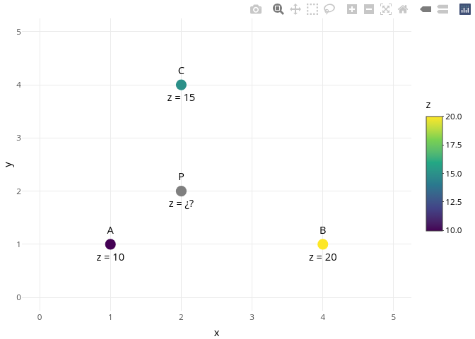

Interpolación lineal ponderada por la distancia inversa
================
Geomorfología (GEO-114).
2025-02-10

Versión HTML (quizá más legible),
[aquí](https://geomorfologia-master.github.io/interpolacion-idw/README.html)

## Introducción

En este ejercicio, calcularemos el valor de la variable $z$ en un punto
de coordenadas $x_i, y_i$, conocido el valor de la variable en otros
puntos utilizando la **Interpolación Lineal Ponderada por la Distancia
Inversa** (IDW, por sus siglas en inglés). Este método se basa en la
idea de que los puntos más cercanos tienen una mayor influencia en la
estimación del valor en un punto dado que los puntos más alejados.

## Teoría

El valor de la variable $z_i$ en el punto $(x_i, y_i)$ se puede estimar
utilizando la siguiente fórmula:

$$
z_i = \frac{\sum_{j=1}^{n} \frac{z_j}{d_{ij}^p}}{\sum_{j=1}^{n} \frac{1}{d_{ij}^p}}
$$

donde:

- $z_j$ es el valor conocido de la variable en el punto $j$.
- $d_{ij}$ es la distancia entre el punto $i$ y el punto $j$.
- $p$ es el parámetro de ponderación que controla la influencia de la
  distancia (típicamente $p = 2$).
- $n$ es el número total de puntos conocidos.

La distancia entre dos puntos $(x_i, y_i)$ y $(x_j, y_j)$ se calcula
utilizando la distancia euclidiana:

$$
d_{ij} = \sqrt{(x_i - x_j)^2 + (y_i - y_j)^2}
$$

## Ejercicio

### Planteamiento del Problema

Supongamos que tenemos los valores de $z$ en tres puntos $A$, $B$ y $C$
con las siguientes coordenadas y valores:

- Punto $A$: $(x_A, y_A) = (1, 1)$, $z_A = 10$
- Punto $B$: $(x_B, y_B) = (4, 1)$, $z_B = 20$
- Punto $C$: $(x_C, y_C) = (2, 4)$, $z_C = 15$

Queremos estimar el valor de $z_i$ en el punto $P$ de coordenadas
$(x_P, y_P) = (2, 2)$.

### Demostración con código reproducible en R

Primero, calculamos las distancias entre el punto $P$ y cada uno de los
puntos $A$, $B$, y $C$:

``` r
# Coordenadas de los puntos
x_A <- 1; y_A <- 1
x_B <- 4; y_B <- 1
x_C <- 2; y_C <- 4
x_P <- 2; y_P <- 2

# Valores de la variable z
z_A <- 10
z_B <- 20
z_C <- 15
z_P <- NA
```

Gráfico.

``` r
library(tidyverse)
library(plotly)
datos <- data.frame(
  x = c(x_A, x_B, x_C, x_P),
  y = c(y_A, y_B, y_C, y_P),
  z = c(z_A, z_B, z_C, z_P))
grafico_puntos <- datos %>%
  ggplot +
  aes(x = x, y = y, fill = z) +
  geom_point(shape = 21, color = 'transparent', size = 4) +
  geom_text(
    label = paste0(
      c("A", "B", "C", "P"),
      '\n\nz = ',
      ifelse(is.na(datos$z), '¿?', datos$z))) +
  coord_cartesian(xlim = c(0, 5), ylim = c(0, 5)) +
  scale_fill_viridis_c() +
  theme_minimal()
ggplotly(grafico_puntos)
```

<!-- -->

Distancias.

``` r
# Distancias euclidianas
d_PA <- sqrt((x_P - x_A)^2 + (y_P - y_A)^2)
d_PB <- sqrt((x_P - x_B)^2 + (y_P - y_B)^2)
d_PC <- sqrt((x_P - x_C)^2 + (y_P - y_C)^2)

cat('Distancia entre A y P:', round(d_PA, 2))
```

Distancia entre A y P: 1.41

``` r
cat('Distancia entre B y P:', round(d_PB, 2))
```

Distancia entre B y P: 2.24

``` r
cat('Distancia entre C y P:', round(d_PC, 2))
```

Distancia entre C y P: 2

``` r
# Parámetro de ponderación
p <- 2

# Cálculo del valor interpolado en P
z_P <- (z_A / d_PA^p + z_B / d_PB^p + z_C / d_PC^p) /
       (1 / d_PA^p + 1 / d_PB^p + 1 / d_PC^p)

cat('Valor interpolado de z en P:', round(z_P, 2))
```

Valor interpolado de z en P: 13.42

## Tu turno

Mandato: estima, por medio de interpolación lineal ponderada por la
distancia inversa, el valor de la variable $Z$ en el punto $P$ de
coordenadas $( X, Y )$

``` r
# Cargar las librerías necesarias
library(knitr)
library(dplyr)

# Número de estudiantes
num_students <- 20

# Función para generar una tabla para cada estudiante
generate_table <- function(student_id) {
  
  # Generar coordenadas y valores de Z aleatorios para los puntos A, B, C
  points <- data.frame(
    `ID Punto` = c("A", "B", "C"),
    X = sample(1:10, 3),
    Y = sample(1:10, 3),
    Z = sample(10:100, 3),
    check.names = F
  )
  
  # Generar las coordenadas del punto P para el estudiante
  point_P <- data.frame(
    `ID Punto` = "P",
    X = sample(1:10, 1),
    Y = sample(1:10, 1),
    Z = NA,
    check.names = F
  )
  
  # Combinar las coordenadas de los puntos A, B, C y P
  full_table <- bind_rows(points, point_P)
  
  # Crear una lista que combine el encabezado con la tabla
  output <- list(
    paste0("**Estudiante #", student_id, "**"),
    kable(full_table, align = "c")
  )
  
  return(list(full_table, output))
}

# Generar las 20 tablas estableceiendo la semilla para reproducibilidad
set.seed(123); tables_list <- lapply(
  1:num_students, function(x) generate_table(x)[[2]])
set.seed(123); tables_df <- lapply(
  1:num_students, function(x) generate_table(x)[[1]])

# Imprimir las tablas
for (table in tables_list) {
  cat(table[[1]], "\n\n")
  print(table[[2]])
  cat("\n\n")
}
```

**Estudiante \#1**

| ID Punto |  X  |  Y  |  Z  |
|:--------:|:---:|:---:|:---:|
|    A     |  3  |  2  | 23  |
|    B     | 10  |  6  | 34  |
|    C     |  2  |  3  | 78  |
|    P     |  3  |  9  | NA  |

**Estudiante \#2**

| ID Punto |  X  |  Y  |  Z  |
|:--------:|:---:|:---:|:---:|
|    A     |  9  |  3  | 16  |
|    B     | 10  |  8  | 51  |
|    C     |  5  |  2  | 18  |
|    P     |  3  |  4  | NA  |

**Estudiante \#3**

| ID Punto |  X  |  Y  |  Z  |
|:--------:|:---:|:---:|:---:|
|    A     |  1  | 10  | 50  |
|    B     |  7  |  7  | 83  |
|    C     |  5  |  1  | 32  |
|    P     |  5  |  7  | NA  |

**Estudiante \#4**

| ID Punto |  X  |  Y  |  Z  |
|:--------:|:---:|:---:|:---:|
|    A     |  5  |  2  | 85  |
|    B     |  6  |  5  | 72  |
|    C     |  1  |  8  | 22  |
|    P     |  2  |  1  | NA  |

**Estudiante \#5**

| ID Punto |  X  |  Y  |  Z  |
|:--------:|:---:|:---:|:---:|
|    A     |  9  |  5  | 99  |
|    B     | 10  |  9  | 69  |
|    C     |  6  |  7  | 25  |
|    P     |  4  |  6  | NA  |

**Estudiante \#6**

| ID Punto |  X  |  Y  |  Z  |
|:--------:|:---:|:---:|:---:|
|    A     |  8  |  7  | 59  |
|    B     |  6  |  1  | 43  |
|    C     |  9  |  6  | 13  |
|    P     |  5  |  6  | NA  |

**Estudiante \#7**

| ID Punto |  X  |  Y  |  Z  |
|:--------:|:---:|:---:|:---:|
|    A     |  3  |  6  | 34  |
|    B     |  9  |  9  | 96  |
|    C     |  4  |  8  | 44  |
|    P     |  8  |  9  | NA  |

**Estudiante \#8**

| ID Punto |  X  |  Y  |  Z  |
|:--------:|:---:|:---:|:---:|
|    A     |  3  |  7  | 88  |
|    B     |  7  |  6  | 94  |
|    C     | 10  |  2  | 46  |
|    P     |  8  |  3  | NA  |

**Estudiante \#9**

| ID Punto |  X  |  Y  |  Z  |
|:--------:|:---:|:---:|:---:|
|    A     | 10  |  2  | 85  |
|    B     |  2  |  6  | 93  |
|    C     |  9  |  7  | 55  |
|    P     |  1  |  6  | NA  |

**Estudiante \#10**

| ID Punto |  X  |  Y  |  Z  |
|:--------:|:---:|:---:|:---:|
|    A     |  3  |  3  | 96  |
|    B     |  8  |  8  | 16  |
|    C     |  6  |  1  | 88  |
|    P     |  7  | 10  | NA  |

**Estudiante \#11**

| ID Punto |  X  |  Y  |  Z  |
|:--------:|:---:|:---:|:---:|
|    A     |  6  | 10  | 25  |
|    B     |  7  |  5  | 33  |
|    C     |  3  |  6  | 41  |
|    P     |  5  |  7  | NA  |

**Estudiante \#12**

| ID Punto |  X  |  Y  |  Z  |
|:--------:|:---:|:---:|:---:|
|    A     |  4  |  7  | 18  |
|    B     |  3  |  6  | 80  |
|    C     |  1  |  2  | 57  |
|    P     |  3  |  8  | NA  |

**Estudiante \#13**

| ID Punto |  X  |  Y  |  Z  |
|:--------:|:---:|:---:|:---:|
|    A     |  4  |  1  | 98  |
|    B     |  7  |  8  | 25  |
|    C     | 10  |  6  | 97  |
|    P     |  6  |  4  | NA  |

**Estudiante \#14**

| ID Punto |  X  |  Y  |  Z  |
|:--------:|:---:|:---:|:---:|
|    A     |  8  |  4  | 31  |
|    B     |  3  | 10  | 58  |
|    C     |  5  |  9  | 51  |
|    P     |  4  |  9  | NA  |

**Estudiante \#15**

| ID Punto |  X  |  Y  |  Z  |
|:--------:|:---:|:---:|:---:|
|    A     |  7  |  5  | 86  |
|    B     |  8  |  2  | 55  |
|    C     |  6  |  3  | 79  |
|    P     |  9  |  8  | NA  |

**Estudiante \#16**

| ID Punto |  X  |  Y  |  Z  |
|:--------:|:---:|:---:|:---:|
|    A     | 10  |  5  | 42  |
|    B     |  4  |  7  | 49  |
|    C     |  5  | 10  | 99  |
|    P     | 10  |  9  | NA  |

**Estudiante \#17**

| ID Punto |  X  |  Y  |  Z  |
|:--------:|:---:|:---:|:---:|
|    A     |  8  |  5  | 16  |
|    B     |  2  |  9  | 67  |
|    C     |  5  |  7  | 70  |
|    P     | 10  |  8  | NA  |

**Estudiante \#18**

| ID Punto |  X  |  Y  |  Z  |
|:--------:|:---:|:---:|:---:|
|    A     |  6  |  1  | 38  |
|    B     |  7  |  9  | 19  |
|    C     |  2  |  5  | 62  |
|    P     |  6  |  9  | NA  |

**Estudiante \#19**

| ID Punto |  X  |  Y  |  Z  |
|:--------:|:---:|:---:|:---:|
|    A     |  4  |  7  | 33  |
|    B     |  7  |  4  | 66  |
|    C     |  1  |  5  | 82  |
|    P     |  9  |  5  | NA  |

**Estudiante \#20**

| ID Punto |  X  |  Y  |  Z  |
|:--------:|:---:|:---:|:---:|
|    A     |  7  |  1  | 90  |
|    B     |  6  | 10  | 38  |
|    C     |  3  |  2  | 35  |
|    P     |  5  |  7  | NA  |

## Función para calcular el valor interpolado en un punto P usando IDW

``` r
idw_interpolation <- function(x_coords, y_coords, z_values, x_p, y_p, p = 2) {
  # Calcular las distancias entre el punto P y cada uno de los puntos conocidos
  distances <- sqrt((x_coords - x_p)^2 + (y_coords - y_p)^2)
  
  # Aplicar la fórmula de IDW para calcular z_p
  numerator <- sum(z_values / distances^p)
  denominator <- sum(1 / distances^p)
  
  z_p <- numerator / denominator
  
  return(list(distances = distances, z_p = z_p))
}
```

Aplicar la función para calcular el valor interpolado en P para todos
los estudiantes

``` r
solucion <- sapply(1:20, function(estudiante) idw_interpolation(
    x_coords = tables_df[[estudiante]][1:3,]$X,
    y_coords = tables_df[[estudiante]][1:3,]$Y,
    z_values = tables_df[[estudiante]][1:3,]$Z,
    x_p = tables_df[[estudiante]][4,]$X,
    y_p = tables_df[[estudiante]][4,]$Y,
    p = 2), simplify = F)
names(solucion) <- paste0('Estudiante ', 1:20)
```

Imprimir soluciones.

``` r
imprimir_con_cat <- function(desde, valor) {
  cat('Distancia entre', desde, 'y P:', round(valor, 2), '\n')
}
invisible(sapply(
  solucion,
  function(estudiante) {
    imprimir_con_cat('A', estudiante$distances[1])
    imprimir_con_cat('B', estudiante$distances[2])
    imprimir_con_cat('C', estudiante$distances[3])
    cat('Valor interpolado de z en P:', round(estudiante$z_p, 2), '\n\n')
    cat('\n\n')
  }
))
```

Distancia entre A y P: 7 Distancia entre B y P: 7.62 Distancia entre C y
P: 6.08 Valor interpolado de z en P: 48.92

Distancia entre A y P: 6.08 Distancia entre B y P: 8.06 Distancia entre
C y P: 2.83 Valor interpolado de z en P: 20.71

Distancia entre A y P: 5 Distancia entre B y P: 2 Distancia entre C y P:
6 Valor interpolado de z en P: 74.39

Distancia entre A y P: 3.16 Distancia entre B y P: 5.66 Distancia entre
C y P: 7.07 Valor interpolado de z en P: 73.98

Distancia entre A y P: 5.1 Distancia entre B y P: 6.71 Distancia entre C
y P: 2.24 Valor interpolado de z en P: 39.67

Distancia entre A y P: 3.16 Distancia entre B y P: 5.1 Distancia entre C
y P: 4 Valor interpolado de z en P: 41.63

Distancia entre A y P: 5.83 Distancia entre B y P: 1 Distancia entre C y
P: 4.12 Valor interpolado de z en P: 91.51

Distancia entre A y P: 6.4 Distancia entre B y P: 3.16 Distancia entre C
y P: 2.24 Valor interpolado de z en P: 63.95

Distancia entre A y P: 9.85 Distancia entre B y P: 1 Distancia entre C y
P: 8.06 Valor interpolado de z en P: 92.35

Distancia entre A y P: 8.06 Distancia entre B y P: 2.24 Distancia entre
C y P: 9.06 Valor interpolado de z en P: 25.27

Distancia entre A y P: 3.16 Distancia entre B y P: 2.83 Distancia entre
C y P: 2.24 Valor interpolado de z en P: 34.88

Distancia entre A y P: 1.41 Distancia entre B y P: 2 Distancia entre C y
P: 6.32 Valor interpolado de z en P: 39.26

Distancia entre A y P: 3.61 Distancia entre B y P: 4.12 Distancia entre
C y P: 4.47 Valor interpolado de z en P: 74.61

Distancia entre A y P: 6.4 Distancia entre B y P: 1.41 Distancia entre C
y P: 1 Valor interpolado de z en P: 52.98

Distancia entre A y P: 3.61 Distancia entre B y P: 6.08 Distancia entre
C y P: 5.83 Valor interpolado de z en P: 78.17

Distancia entre A y P: 4 Distancia entre B y P: 6.32 Distancia entre C y
P: 5.1 Valor interpolado de z en P: 60.79

Distancia entre A y P: 3.61 Distancia entre B y P: 8.06 Distancia entre
C y P: 5.1 Valor interpolado de z en P: 37.88

Distancia entre A y P: 8 Distancia entre B y P: 1 Distancia entre C y P:
5.66 Valor interpolado de z en P: 20.57

Distancia entre A y P: 5.39 Distancia entre B y P: 2.24 Distancia entre
C y P: 8 Valor interpolado de z en P: 62.45

Distancia entre A y P: 6.32 Distancia entre B y P: 3.16 Distancia entre
C y P: 5.39 Valor interpolado de z en P: 45.5

<!-- cat('Distancia entre A y P:', round(d_PA, 2)) -->
<!-- cat('Distancia entre B y P:', round(d_PB, 2)) -->
<!-- cat('Distancia entre C y P:', round(d_PC, 2)) -->
